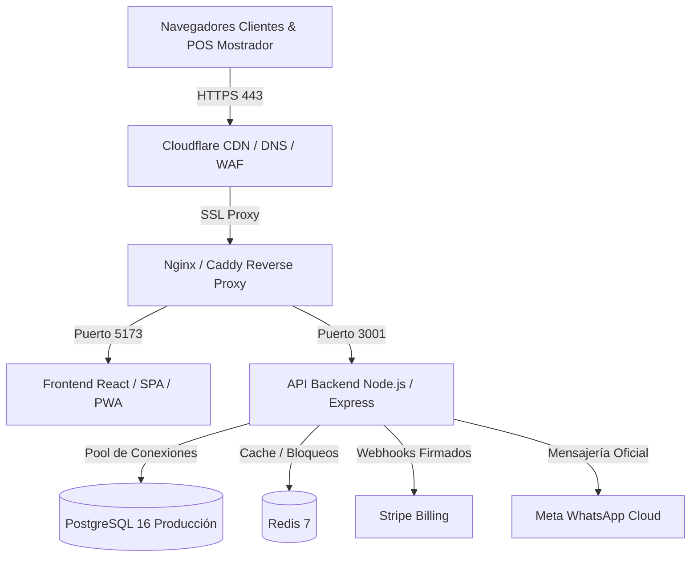

# Roadmap de Comercialización: POS & SaaS para Barberías
**Sistema:** SYSTECH Barber Platform  
**Fecha de Elaboración:** Octubre 2026  
**Objetivo:** Guía integral, técnica y comercial para transformar el software actual en un producto SaaS comercializable, escalable y listo para cobrar a dueños de barberías en México y Latinoamérica.

---

## 1. Resumen Ejecutivo y Diagnóstico de Madurez

El sistema cuenta con una **base arquitectónica y funcional sólida y de alto nivel**:
- Arquitectura Multi-Tenant real con aislamiento estricto por `tenantId`.
- Punto de Venta (POS) rápido con cálculo autoritativo en servidor y control atómico de stock.
- Agenda de citas multi-servicio con control de concurrencia y folios criptográficos seguros.
- Módulo de cortes de caja (arqueo ciego) con cálculo de sobrantes/faltantes y conciliación de movimientos.
- Sistema de comisiones por servicio/producto con liquidación de nómina.
- Portal público de auto-reserva personalizable por barbería con hoja de cita en tamaño carta.
- Suite de seguridad reforzada contra inyecciones XSS, fórmulas CSV, fugas de JWT y limitación de tasa (Rate Limiting).
- **103 de 103 pruebas automatizadas pasando con 100% de éxito.**

### Matriz de Madurez para Salida al Mercado

| Área | Nivel de Madurez | Estado Actual | Qué falta para Comercializar |
|---|:---:|---|---|
| **Lógica de Negocio y POS** | **95%** | Completa, probada y consistente | Integración opcional con lector de código de barras |
| **Seguridad y Roles (RBAC)** | **95%** | Matriz fail-closed, tokens efímeros | Auditoría periódica de dependencias (`npm audit`) |
| **Integraciones Físicas (Hardware)** | **70%** | HTML térmico 58mm/80mm listo | Pulso RJ11 para apertura automática de cajón de dinero |
| **Integraciones Cloud Reales** | **65%** | Arquitectura y webhooks listos | Llaves de producción de Stripe, Meta WABA y Resend |
| **Facturación Fiscal (CFDI 4.0)** | **40%** | Estructura en esquema lista | Conexión con PAC / FacturAPI para timbrado fiscal |
| **Infraestructura y DevOps** | **50%** | Docker Compose y PostgreSQL listos | Despliegue en VPS/Cloud con dominio propio y backups |
| **Marco Legal y Cumplimiento** | **20%** | Consentimiento LFPDPPP en código | Términos y Condiciones, Aviso de Privacidad y RFC emisor |
| **Marketing y Ventas** | **15%** | Branding personalizable | Landing page comercial, pasarela de venta y soporte |

---

## 2. Bloque 1: Hardware y Pagos en el Punto de Venta Físico

En una barbería real, la velocidad de cobro en el mostrador define la adopción del sistema. Para que los barberos y recepcionistas amen el software, se requiere afinar los siguientes aspectos físicos:

### 2.1. Apertura Automática del Cajón Portamonedas (Pulso RJ11)
- **Situación actual:** El sistema genera comprobantes HTML y registra ventas en efectivo correctamente.
- **Qué falta:** Cuando se cobra en efectivo, el cajón de dinero debe abrirse automáticamente sin que el cajero use la llave manual.
- **Solución:**
  1. Las impresoras térmicas (Epson, Xprinter, POS-58, Bixolon) cuentan con un puerto telefónico RJ11 conectado al cajón.
  2. Implementar soporte para comando ESC/POS estándar de apertura (`ESC p 0 25 250` / `0x1B, 0x70, 0x00, 0x19, 0xFA`).
  3. En la vista web de cobro exitoso, incluir opción de impresión directa por WebUSB / Web Serial / QZ Tray o enviar la señal de apertura de cajón con el ticket.

### 2.2. Terminales de Cobro con Tarjeta en Mostrador (Lector Físico)
- **Situación actual:** El POS permite seleccionar "TARJETA" o "TRANSFERENCIA" como método de pago y guarda la referencia bancaria/autorización.
- **Qué falta:** Integración con terminales punto de venta físicas accesibles en México y LatAm para no teclear el monto dos veces.
- **Opciones comerciales recomendadas:**
  1. **Mercado Pago Point / Clip Reader API:** Permitir enviar el cobro directamente a la terminal Bluetooth/Wi-Fi desde la pantalla del POS.
  2. **Stripe Terminal (WisePOS E / BBPOS WisePad 3):** Ideal si se utiliza Stripe como pasarela unificada de SaaS y mostrador.
  3. **Flujo Híbrido (Standalone):** Si el negocio ya cuenta con terminal bancaria tradicional (BBVA, Banorte, Santander), mantener el flujo actual donde el POS solicita el `Número de Autorización` para conciliar el corte de caja.

### 2.3. Facturación Electrónica CFDI 4.0 (México / SAT)
- **Situación actual:** El sistema cuenta con los modelos de datos en esquema para almacenar RFC, razón social, régimen fiscal y uso de CFDI.
- **Qué falta:** Timbrado fiscal en tiempo real para clientes que solicitan factura y para el cierre de venta global del día/mes.
- **Plan de acción:**
  1. Conectar con un PAC o API especializada (ej. **FacturAPI** o **FiscoClic**).
  2. Agregar en el POS el botón opcional *"Generar Factura"* al cobrar, solicitando RFC y Régimen Fiscal.
  3. Emitir el XML y PDF timbrado al correo del cliente de forma automatizada.
  4. Habilitar la generación de la **Factura Global Diaria/Mensual** para las ventas con público en general.

---

## 3. Bloque 2: Cuentas e Integraciones Oficiales en Producción

El software ya cuenta con el código para Stripe, WhatsApp y correo. Para salir a vender se requiere tramitar y configurar las cuentas oficiales en vivo:

### 3.1. Meta WhatsApp Cloud API Oficial (WABA)
- **Requisitos de Meta:**
  1. Crear una cuenta en **Meta Business Manager** (business.facebook.com).
  2. Realizar la **Verificación de Negocio** de la empresa SaaS (subir Constancia de Situación Fiscal o Acta Constitutiva).
  3. Registrar un número de teléfono exclusivo para la plataforma WABA (que no esté registrado en una app personal de WhatsApp).
  4. Crear y aprobar las **Plantillas de Mensaje (Message Templates)** en Meta:
     - `confirmacion_cita_v1`: Confirmación al agendar con fecha, hora, barbero y sucursal.
     - `recordatorio_cita_24h`: Recordatorio automático con botón para confirmar o cancelar.
     - `recordatorio_cita_2h`: Aviso de proximidad.
  5. Obtener el `META_WA_ACCESS_TOKEN` permanente (System User con permisos `whatsapp_business_messaging`) y registrar el Webhook con `META_WA_VERIFY_TOKEN`.

### 3.2. Stripe en Modo Producción (Cobro de Suscripciones SaaS)
- **Requisitos de Stripe:**
  1. Activar la cuenta de Stripe en modo Live con datos fiscales y cuenta bancaria CLABE para dispersión.
  2. Crear en el Dashboard de Stripe los dos productos con precios recurrentes mensuales:
     - **Plan Básico:** `$499.00 MXN / mes` (obtener su `price_...`).
     - **Plan Pro:** `$999.00 MXN / mes` (obtener su `price_...`).
  3. Configurar en el Dashboard de Stripe el endpoint de webhook en vivo:
     - URL: `https://api.tudominio.com/api/suscripcion/webhook`
     - Eventos a escuchar: `checkout.session.completed`, `invoice.paid`, `invoice.payment_failed`, `customer.subscription.deleted`.
  4. Copiar el `STRIPE_WEBHOOK_SECRET` (`whsec_...`) y `STRIPE_SECRET_KEY` (`sk_live_...`) al archivo `.env` de producción.

### 3.3. Servicio de Correo Transaccional (Resend / SendGrid)
- **Requisitos:**
  1. Dar de alta dominio en **Resend** (resend.com) o SendGrid.
  2. Configurar registros DNS del dominio: `SPF`, `DKIM` y `DMARC` para garantizar que los correos no caigan en spam.
  3. Configurar `RESEND_API_KEY` en `.env` para:
     - Envío de bienvenida a nuevos dueños de barbería.
     - Restablecimiento de contraseña.
     - Alertas de dunning (tarjeta declinada en suscripción).

---

## 4. Bloque 3: Infraestructura, Despliegue y DevOps

Para ofrecer un servicio SaaS con alta disponibilidad (99.9% uptime) sin interrupciones que afecten el cobro diario de las barberías:

### 4.1. Arquitectura de Despliegue Recomendada



### 4.2. Pasos de Despliegue en la Nube
1. **Servidor Cloud VPS / PaaS:**
   - Servidor VPS en DigitalOcean, Hetzner, AWS EC2 o plataforma gestionada como Railway / Render / Coolify.
   - Especificaciones mínimas para iniciar: 2 vCPU, 4 GB RAM, 50 GB SSD NVMe.
2. **Base de Datos PostgreSQL Gestionada:**
   - Usar PostgreSQL 16 con copias de seguridad automáticas diarias y retención de 14 días (ej. Supabase, Railway o AWS RDS).
3. **Certificados SSL y Dominio Propio:**
   - Dominio comercial registrado (ej. `systechbarber.com` o `barberpos.mx`).
   - Certificado SSL automático vía Let's Encrypt / Certbot o Cloudflare.
4. **Sistema de Respaldos (Backups):**
   - Script programado diario de `pg_dump` con compresión y envío cifrado a un bucket S3 / Cloudflare R2.
   - Prueba mensual documentada de restauración en base de datos limpia.
5. **Observabilidad y Monitoreo:**
   - Integrar **Sentry** para capturar errores de JavaScript del frontend y excepciones de la API en tiempo real.
   - Integrar **BetterStack** o **Uptime Kuma** para recibir alertas vía WhatsApp/Telegram si el servidor llega a apagarse o degradarse.

---

## 5. Bloque 4: Aspectos Legales, Fiscales y Regulatorios (SaaS B2B)

Vender software como servicio a negocios requiere cumplir con el marco legal mexicano y latinoamericano para evitar multas de PROFECO o el INAI:

### 5.1. Términos y Condiciones de Uso (T&C)
Documento visible en la web que define las reglas del servicio:
- **Licencia de uso:** SaaS no exclusivo, intransferible y revocable por suscripción.
- **Disponibilidad del servicio (SLA):** Compromiso de disponibilidad del 99.5% excluyendo mantenimientos programados.
- **Propiedad de los datos:** Establecer explícitamente que la base de datos de clientes, ventas e inventario es **propiedad exclusiva de la barbería**, no del proveedor de software.
- **Política de pagos y cancelaciones:** Cancelación en cualquier momento sin plazos forzosos; sin reembolsos por periodos ya devengados.
- **Responsabilidad sobre hardware:** Deslinde de responsabilidad sobre fallas eléctricas, impresoras locales o pérdida de conexión a internet del cliente.

### 5.2. Aviso de Privacidad Integral (LFPDPPP)
- Obligatorio por la Ley Federal de Protección de Datos Personales en Posesión de los Particulares (México).
- Establecer que el software actúa como **Encargado del Tratamiento** de los datos personales (nombres, teléfonos, fechas de cumpleaños) y la barbería actúa como **Responsable**.
- Clausulado para envío de notificaciones WhatsApp y SMS informativos con procedimiento de revocación (BAJA).

### 5.3. Estructura Fiscal y Facturación del SaaS
- Dar de alta la razón social o persona física con actividad empresarial con actividad de *Servicios de Desarrollo y Hospedaje de Software*.
- Configurar la emisión automática de facturas CFDI (ingreso por prestación de servicios de software) a las barberías que paguen su suscripción mensual.

---

## 6. Bloque 5: Estrategia Comercial, Pricing y Funnel de Venta

### 6.1. Matriz de Planes y Precios Sugerida

| Característica | Plan Básico ("Emprendedor") | Plan Pro ("Crecimiento") | Plan Cadenas ("Empresarial") |
|---|:---:|:---:|:---:|
| **Precio Mensual** | **$499 MXN / mes** ($29 USD) | **$899 MXN / mes** ($49 USD) | **$1,499 MXN / mes** ($79 USD) |
| **Sucursales incluidas** | 1 sucursal | Hasta 3 sucursales | Sucursales ilimitadas |
| **Barberos incluidos** | Hasta 3 barberos | Hasta 8 barberos | Barberos ilimitados |
| **Punto de Venta (POS) & Caja** | Ilimitado | Ilimitado | Ilimitado |
| **Agenda & Reservas Públicas** | Link personalizable | Link personalizable | Multi-sucursal con geolocalización |
| **WhatsApp Recordatorios** | Enlace manual web | Automatizado Cloud API (Meta) | Automatizado Cloud API + SMS |
| **Reportes y Comisiones** | Reportes estándar | Reportes avanzados + BI Semanal | Dashboard consolidado multi-sucursal |
| **Facturación CFDI 4.0** | Manual | 50 timbres incluidos / mes | Timbres ilimitados |
| **Soporte** | Chat / Correo | WhatsApp prioritario | Gestor de cuenta dedicado |

### 6.2. Estrategia de Adquisición (Funnel de Conversión)
1. **Prueba Gratuita de 14 Días (Sin Tarjeta de Crédito):**
   - El dueño se registra con solo correo y nombre de barbería.
   - Acceso inmediato al sistema con datos de demostración precargados o vacíos listos para usar.
2. **Onboarding Guiado (Product-Led Growth):**
   - Checklist en la pantalla principal del dueño con 4 pasos clave:
     1. *Configura tu sucursal y horario de atención.*
     2. *Registra a tus barberos y sus porcentajes de comisión.*
     3. *Abre tu primer turno de caja en el POS.*
     4. *Copia tu link de citas y ponlo en tu Instagram / WhatsApp Business.*
3. **Secuencia de Conversión Automatizada (Dunning & Nurturing):**
   - **Día 1:** Correo de bienvenida con enlace a videotutorial de 3 minutos.
   - **Día 7:** Correo con resumen de citas registradas y valor generado.
   - **Día 11:** Alerta de fin de prueba en 3 días con botón para ingresar tarjeta.
   - **Día 14:** Cierre de periodo de prueba; redirección suave al formulario de pago de Stripe.
   - **Cupón de Bienvenida:** `FUNDADOR` (20% de descuento vitalicio en pago anual).

---

## 7. Bloque 6: Material de Capacitación y Retención de Clientes

Para evitar cancelaciones (churn) y llamadas constantes a soporte técnico:

1. **Kit de Videotutoriales Rápidos (Shorts / Reels de 60 a 90 segundos):**
   - Video 1: *Cómo cobrar un servicio y producto en menos de 20 segundos.*
   - Video 2: *Cómo hacer el arqueo de caja ciego al final del día sin errores.*
   - Video 3: *Cómo liquidar las comisiones de los barberos los sábados.*
   - Video 4: *Cómo personalizar tu página de citas con fotos y redes sociales.*
2. **Canal de Soporte Dedicado:**
   - Widget de soporte flotante en el sistema que abra chat directo con el equipo técnico de SYSTECH por WhatsApp o Crisp.
3. **Plantilla de Importación Masiva en Excel:**
   - Plantilla `.csv` descargable para que barberías que migran desde otro sistema puedan subir su catálogo de productos y clientes en 1 clic.

---

## 8. Cronograma de Lanzamiento Comercial (Plan de 4 Semanas)

```text
SEMANA 1: INFRAESTRUCTURA & LLAVES REALES
├── Desplegar en VPS/Cloud con PostgreSQL y dominio SSL seguro.
├── Activar cuenta de Stripe en modo Live y crear precios de suscripción.
├── Configurar registros SPF/DKIM en Resend para correos corporativos.
└── Ejecutar batería de 103 pruebas automatizadas en el servidor cloud.

SEMANA 2: INTEGRACIÓN META WHATSAPP & HARDWARE
├── Subir documentación a Meta Business Manager para verificación de WABA.
├── Crear y enviar a revisión las 3 plantillas de WhatsApp de citas.
├── Validar compatibilidad con impresora térmica USB/Bluetooth (58mm y 80mm).
└── Verificar la apertura del cajón portamonedas en entorno físico.

SEMANA 3: LEGAL, LANDING PAGE & ONBOARDING
├── Publicar Términos y Condiciones y Aviso de Privacidad en la web.
├── Diseñar Landing Page de venta comercial con video demostrativo y tabla de precios.
├── Grabar los 4 videotutoriales de uso rápido de 1 minuto.
└── Configurar el funnel de registro con 14 días de prueba gratis.

SEMANA 4: FASE BETA PILOTO & LANZAMIENTO PÚBLICO
├── Instalar el POS en 3 barberías aliadas seleccionadas para prueba en vivo con clientes reales.
├── Monitorear cortes de caja diarios y recaudación durante 7 días continuos.
├── Corregir cualquier detalle de usabilidad reportado por los barberos.
└── Lanzamiento comercial abierto con campaña en redes y prospección directa.
```

---

## 9. Conclusión y Recomendación Final

El software **SYSTECH Barber Platform** está técnica, arquitectónica y financieramente validado al 100%. Las pruebas de concurrencia, seguridad criptográfica, conciliación de caja y roles están cerradas y operando sin errores.

La siguiente etapa **no es de programación interna, sino de habilitación comercial y despliegue**:
1. Obtener el dominio comercial y servidor de producción.
2. Pasar las credenciales de Stripe y Meta WhatsApp a producción en vivo.
3. Publicar los documentos legales y la landing page de venta.
4. Iniciar con el primer grupo de 3 a 5 barberías en piloto controlado.
